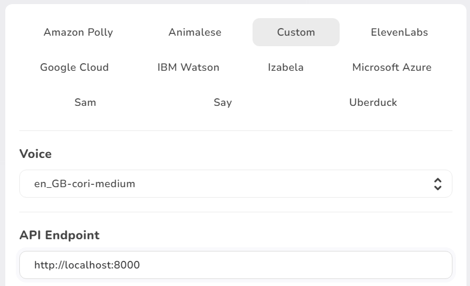

# Piper Server for Izabela

A simple web server that exposes endpoints for use with [Izabela](https://github.com/nature-heart-software/izabela) and that calls out to a local instance of [Piper TTS](https://github.com/rhasspy/piper).

# How to use (Windows)

1. Download the [Windows release ZIP](https://github.com/zqlk256/izabela-piper/releases/tag/v1.0) and unpack it somewhere

2. Edit the `settings.toml`, specifically the `voice_dir` and `piper_exe` paths.

3. Run the EXE. This will scan the voice directory and start the web server.

4. Configure Izabela to talk to the web server. Unless you changed it in the settings file the API endpoint should be `http://localhost:8000`

   